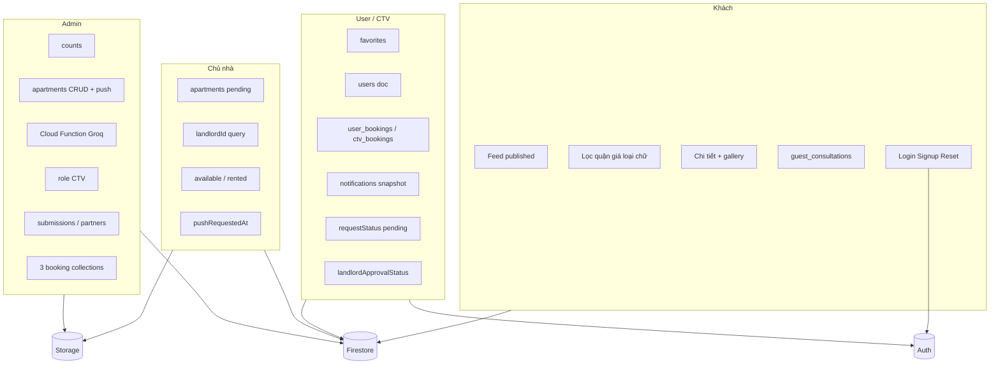
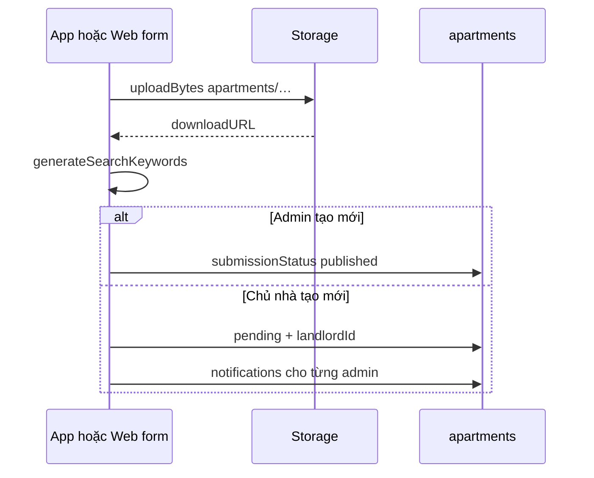
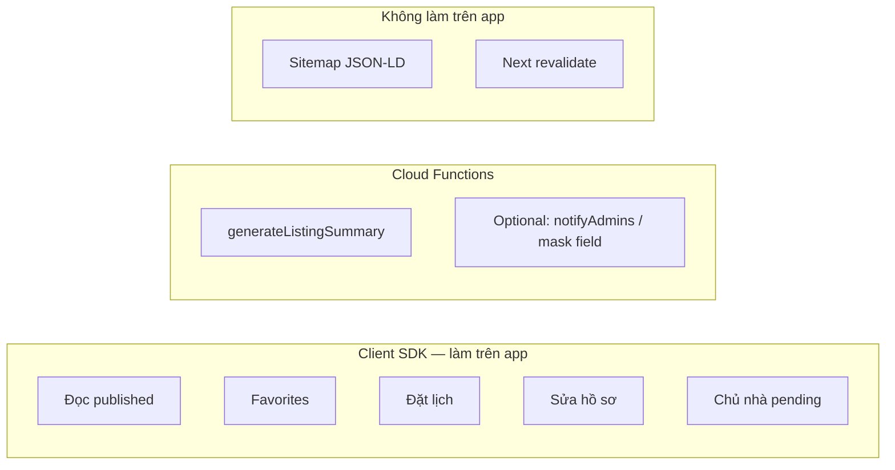

# GRAPH_REPORT — Web ↔ Mobile (Hướng 1)

Báo cáo kiến trúc để clone chức năng website sang app **cùng Firebase**. Không thay `graphify-out/GRAPH_REPORT.md` (file đó do graphify generate).

**Project:** Hanoi Residences (`quang-apartment`)  
**Web:** Next.js App Router · Server Actions · Firebase JS SDK  
**App (mục tiêu):** Expo · cùng Auth / Firestore / Storage  
**Nguồn sự thật:** Cloud Firestore, không phải Server Actions

## God nodes

Đây là nút mọi luồng phải đi qua. App mới **bắt buộc** nói chuyện với chúng, không vòng qua Next.js.

| Node | Path website | Vai trò với app |
|---|---|---|
| Firebase project | `src/firebase/config.ts` | Cùng `projectId` |
| `apartments` | `src/lib/data.ts` | Feed, chi tiết, admin, chủ nhà |
| `users` + `favorites` | `auth-service.ts`, `data.ts` | Hồ sơ, role, CTV, landlord |
| Auth | `src/lib/auth-service.ts` | UID đồng bộ web/app |
| Storage `apartments/*` | `apartment-form.tsx`, `actions.ts` | Ảnh tin |
| `notifications` | `notifications.ts`, `use-notifications.ts` | Chuông realtime |
| `user_bookings` / `ctv_bookings` / `guest_consultations` | `booking-widget.tsx` | Lịch hẹn 3 kênh |
| `aiContent` + Groq | `generate-listing-summary.ts` | **Không** gọi từ app; Cloud Function |
| RBAC | `src/lib/rbac.ts` | 4 role, ẩn field |
| Search keywords | `generateSearchKeywords` trong `utils.ts` | Ghi kèm mỗi lần save tin |

## Community — nhóm chức năng

## Cạnh đồng bộ (web ghi → app đọc)

| Sự kiện web | Document | App thấy ngay nếu |
|---|---|---|
| Admin đăng / sửa / đẩy tin | `apartments/{id}` | `onSnapshot` hoặc refetch query published |
| Chủ nhà nộp tin | `apartments` pending + notification admin | Màn duyệt + chuông admin |
| User tim | `users/{uid}/favorites/{id}` | Màn yêu thích |
| Đặt lịch | 1 trong 3 collection bookings | Màn lịch + chuông |
| Duyệt landlord/CTV | `users/{uid}` | Menu/role đổi sau `onSnapshot` user doc |
| AI ghi mô tả | `apartments.aiContent` | Chi tiết tin (description/highlights) |

App **không** cần ping website. Next cache (`unstable_cache`) chỉ làm web chậm cập nhật; app đọc Firestore thì nhanh hơn web nếu dùng snapshot.

## Cạnh không đồng bộ được bằng SDK thuần

| Nguồn | Lý do | Hướng xử lý |
|---|---|---|
| Server Actions | Cookie/RSC, `revalidatePath` | Port write Firestore |
| Groq key | Secret | Cloud Function |
| JSON-LD / sitemap / landing quận | SEO | Bỏ trên app |
| `ADMIN_PATH` | Che URL | Role gate trong app |
| `download-image` | CORS web | Lưu URL Storage |

## Luồng ghi tin (phải giống web)

Đẩy tin admin: `createdAt = updatedAt = now` (batch: millis tăng dần để giữ thứ tự). Sort newest của feed phụ thuộc field này.

## Lỗ hổng rules (ảnh hưởng trực tiếp app)

Repo `firestore.rules`:

- `apartments`: ai cũng `get/list`; **mọi user đã login được write**
- `users`: chỉ CRUD doc của chính mình (không list) + favorites
- **Không có** match cho `notifications`, `user_bookings`, `ctv_bookings`, `guest_consultations`

`storage.rules`: write ảnh `apartments/**` đang `if true`.

Trước khi ship app: viết rules đủ collection + cấm client tự gán `role: admin` / tự `published`. Chi tiết: [NOTES.md](NOTES.md).

## Privilege vs public

## Suggested questions (khi implement)

1. Query feed app đã `submissionStatus == published` chưa?
2. Save tin đã gọi `generateSearchKeywords` chưa?
3. Mã nguồn có `-` đã mask `888` với user thường chưa?
4. Google Sign-In đã `setDoc merge` user doc chưa?
5. AI có đang gọi Groq từ device không? (cấm)
6. Rules deploy đã cover 3 collection booking + notifications chưa?
7. `link` trong notification map sang screen app thế nào?

Muốn truy graph code hiện tại: `graphify query "apartments bookings notifications landlord admin auth"`.
